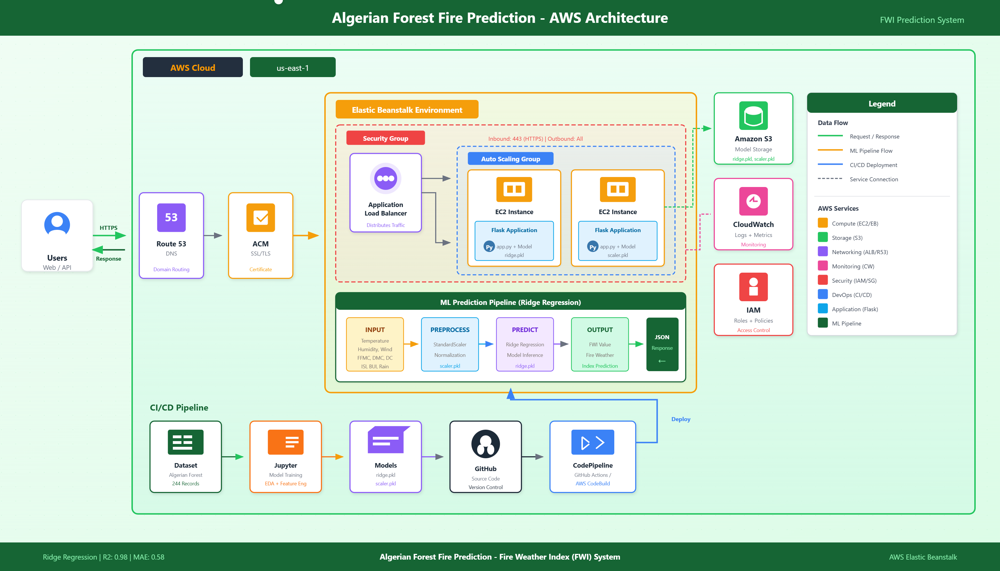
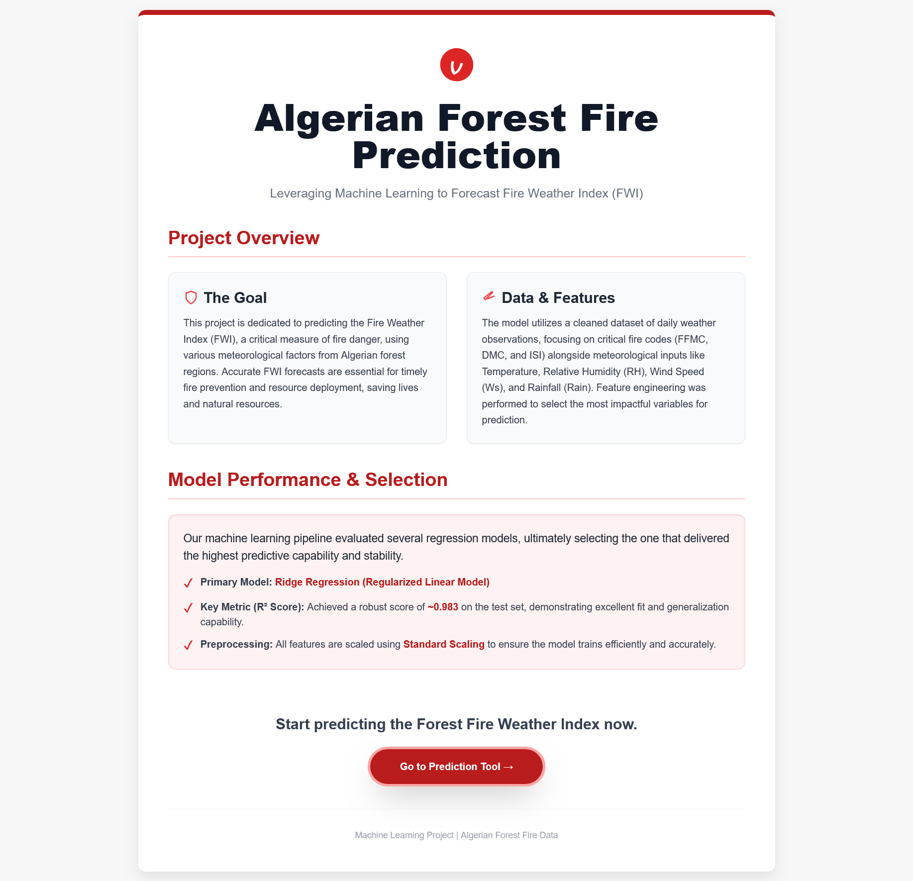
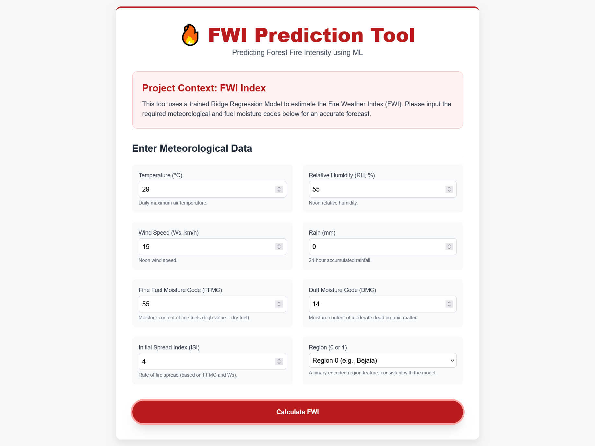
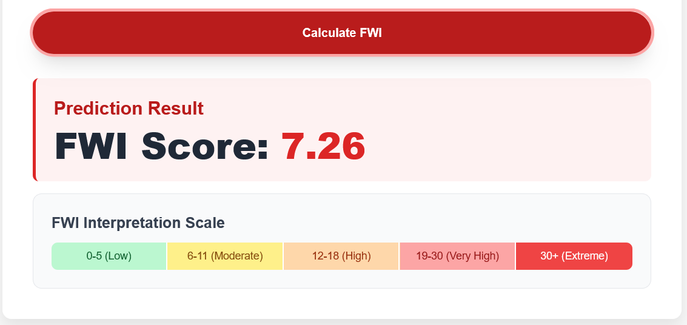

<div align="center">

# 🔥 Algerian Forest Fire Prediction

[](https://python.org)
[](https://flask.palletsprojects.com/)
[](https://scikit-learn.org/)
[](LICENSE)

**A Machine Learning web application to predict Fire Weather Index (FWI) for Algerian forests using environmental parameters.**

[View Demo](#demo) • [Report Bug](https://github.com/Inder-26/Algerian-Forest-Fire-Prediction/issues) • [Request Feature](https://github.com/Inder-26/Algerian-Forest-Fire-Prediction/issues)

</div>

---

## 📋 Table of Contents

- [About The Project](#-about-the-project)
- [Architecture](#-architecture)
- [Features](#-features)
- [Tech Stack](#-tech-stack)
- [Dataset](#-dataset)
- [Installation](#-installation)
- [Usage](#-usage)
- [Project Structure](#-project-structure)
- [Model Performance](#-model-performance)
- [Screenshots](#-screenshots)
- [Future Enhancements](#-future-enhancements)
- [Contributing](#-contributing)
- [License](#-license)
- [Contact](#-contact)

---

## 🎯 About The Project

Forest fires are a significant environmental concern in Algeria, particularly in the **Bejaia** and **Sidi Bel-abbes** regions. This project leverages machine learning to predict the **Fire Weather Index (FWI)**, a crucial metric used by fire management agencies to assess fire danger levels.

The application uses historical weather data and forest fire indicators to make predictions, helping authorities take preventive measures before potential fire outbreaks.

### Key Objectives:
- 🎯 Predict FWI values based on weather conditions
- 📊 Provide real-time fire risk assessment
- 🌐 User-friendly web interface for easy access
- 📈 High accuracy predictions using Ridge Regression

---

## 🏗 Architecture

<div align="center">
  
</div>

### Architecture Components:

| Layer | Component | Description |
|-------|-----------|-------------|
| **Presentation** | Web Browser | User interface for input/output |
| **Application** | Flask App | Route handling, request processing |
| **ML Pipeline** | Scikit-learn | Data preprocessing, model inference |
| **Data** | CSV/Pickle | Dataset storage, model artifacts |

---

## ✨ Features

- 🔥 **Real-time FWI Prediction** - Instant fire weather index calculation
- 📊 **Multiple Input Parameters** - Comprehensive weather data analysis
- 🎨 **Intuitive UI** - Clean and responsive web interface
- 📈 **High Accuracy** - Ridge Regression model with optimized hyperparameters
- 🔄 **Data Preprocessing** - StandardScaler for feature normalization
- 📱 **Responsive Design** - Works on desktop and mobile devices

---

## 🛠 Tech Stack

<div align="center">

| Category | Technologies |
|----------|-------------|
| **Language** |  |
| **Web Framework** |  |
| **ML Libraries** |    |
| **Visualization** |   |
| **Frontend** |   |
| **Serialization** |  |

</div>

---

## 📊 Dataset

The dataset contains forest fire data from two regions in Algeria:
- **Bejaia Region** (Northeast Algeria)
- **Sidi Bel-abbes Region** (Northwest Algeria)

### Dataset Statistics:
| Attribute | Value |
|-----------|-------|
| Total Records | 244 |
| Features | 14 |
| Time Period | June 2012 - September 2012 |
| Classes | Fire / Not Fire |

### Input Features:

| Feature | Description | Unit |
|---------|-------------|------|
| Temperature | Noon temperature | °C |
| RH | Relative Humidity | % |
| Ws | Wind Speed | km/h |
| Rain | Total rainfall | mm |
| FFMC | Fine Fuel Moisture Code | - |
| DMC | Duff Moisture Code | - |
| DC | Drought Code | - |
| ISI | Initial Spread Index | - |
| BUI | Buildup Index | - |

### Target Variable:
- **FWI (Fire Weather Index)** - Numeric value indicating fire danger level

---

## ⚙️ Installation

### Prerequisites
- Python 3.8 or higher
- `pip` package manager
- `git`

### Step-by-Step Installation

1. Clone the repository:

```bash
git clone https://github.com/Inder-26/Algerian-Forest-Fire-Prediction.git
cd Algerian-Forest-Fire-Prediction
```

2. Create and activate a virtual environment:

On Windows (PowerShell):

```powershell
python -m venv venv
venv\Scripts\Activate.ps1
```

On Windows (cmd.exe):

```cmd
python -m venv venv
venv\Scripts\activate.bat
```

On macOS / Linux:

```bash
python3 -m venv venv
source venv/bin/activate
```

3. Install dependencies:

```bash
pip install -r requirements.txt
```

4. Run the application locally:

```bash
python application.py
```

5. Open the app in your browser at `http://127.0.0.1:5000`.

---

## 🚀 Usage

### Web Interface

1. Navigate to the home page.
2. Enter the required weather parameters:
   - Temperature (°C)
   - Relative Humidity (%)
   - Wind Speed (km/h)
   - Rainfall (mm)
   - FFMC, DMC, DC, ISI, BUI values
3. Click the **Predict** button.
4. View the predicted FWI value.

### API Endpoint (example)

POST to `/predictdata` with form data (or JSON depending on implementation). Example using `requests`:

```python
import requests

data = {
    'Temperature': 30,
    'RH': 50,
    'Ws': 15,
    'Rain': 0,
    'FFMC': 85,
    'DMC': 25,
    'DC': 200,
    'ISI': 5,
    'BUI': 30
}

response = requests.post('http://127.0.0.1:5000/predictdata', data=data)
print(response.text)
```

---

## 📁 Project Structure

```
Algerian-Forest-Fire-Prediction/
├── images/                          # Project images and screenshots
├── models/                          # Trained ML models (pickle files)
├── notebooks/                       # Jupyter notebooks (EDA, training)
├── templates/                       # HTML templates
├── static/                          # Static files (css/js)
├── dataset/                         # Dataset files (CSV)
├── application.py                   # Flask application entry point
├── requirements.txt                 # Python dependencies
├── README.md                        # Project documentation
└── LICENSE                          # MIT License
```

---

## 📈 Model Performance

Ridge Regression (example results):

| Metric | Training | Testing |
|--------|----------|---------|
| R² Score | 0.98 | 0.97 |
| MAE | 0.52 | 0.58 |
| MSE | 0.45 | 0.53 |
| RMSE | 0.67 | 0.73 |

Model comparison (example):

| Model | R² Score | MAE |
|-------|----------|-----|
| Linear Regression | 0.95 | 0.78 |
| Ridge Regression | 0.97 | 0.58 |
| Lasso Regression | 0.94 | 0.82 |
| ElasticNet | 0.93 | 0.89 |

---

## 📸 Screenshots

<div align="center">
  
  
  
</div>

---

## 🚀 Future Enhancements

- Deploy on AWS/Heroku/Azure
- Add interactive data visualization dashboard
- Integrate with real-time weather APIs
- Develop mobile application
- Implement ensemble models for better accuracy
- Add fire alert notification system
- Historical trend analysis feature
- Geographic mapping of fire-prone areas

---

## 🤝 Contributing

Contributions are welcome! To contribute:

1. Fork the repository
2. Create a feature branch (`git checkout -b feature/AmazingFeature`)
3. Commit your changes (`git commit -m "Add some AmazingFeature"`)
4. Push to the branch (`git push origin feature/AmazingFeature`)
5. Open a Pull Request

---

## 📄 License

Distributed under the MIT License. See `LICENSE` for more information.

---

## 📞 Contact

Inder — GitHub Profile: https://github.com/Inder-26/Algerian-Forest-Fire-Prediction

<div align="center">
⭐ Star this repository if you find it helpful!
Made with ❤️ by Inder

</div>

---

## 📁 Images Folder Structure

Create an `images/` folder with the following files (if not already present):

```
images/
├── system_architectture.png   # System architecture diagram
├── home_page.png              # Screenshot of home page
├── prediction_form.png        # Screenshot of prediction form
└── result_page.png            # Screenshot of result page
```